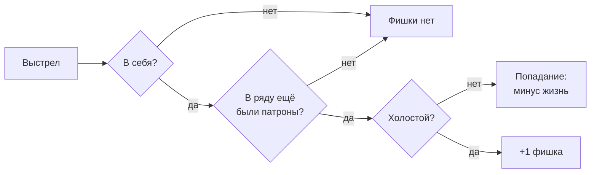

# Фишки

Выстрелить в себя и выжить — значит заработать право решать, где окажется смерть в следующий раз.

**Фишка**{ #t-фишка .term } — единственный способ повлиять на то, где
окажутся патроны, когда ряд заряжается. Фишки зарабатывают риском и
тратят на следующий ряд.

<figure class="illus">

<figcaption>Иллюстрация: стопка фишек на бархате, отблеск неона на кромке.</figcaption>
</figure>

## Как заработать

Игрок получает фишку, если выстрелил **в себя**, выстрел оказался
**холостым** и в момент выстрела в ряду **оставался хотя бы один
патрон**. Без риска фишки нет.

Кто получил фишку, видят все. А раз фишку дают только при патронах в
ряду, её выдача — ещё и подсказка: патроны в ряду остались.

!!! tip "Совет"

    Когда патроны в ряду кончились, выстрел в себя безопасен — но и
    фишки уже не приносит.

## Пул

Фишки, заработанные за расклад, складываются в **пул**{ #t-пул .term } на
следующий расклад. Копить их дольше нельзя: пул тратится целиком в начале
следующего расклада. В самом первом раскладе пул у всех пустой.

## Ставки

Когда в начале расклада объявлено число камор, каждый живой игрок
делает **ставки**{ #t-ставка .term } — ставит фишки из пула на каморы:

- все ставят одновременно и втайне друг от друга;
- фишки можно класть как угодно, в том числе несколько в одну камору;
- ставится весь пул, оставить фишки себе нельзя;
- ставки окончательны.

Свои ставки игрок помнит весь расклад. Чужих ставок не видит никто.

## Вес

У каждой каморы есть **вес**{ #t-вес .term }: единица плюс все фишки,
положенные на неё всеми игроками. Камора без фишек весит один.

?
?
?
?
?
?

На третью камору легли три фишки, на пятую — одна. Третья получит патрон вчетверо охотнее каморы без фишек.

Итоговых весов не видит никто — только свою часть в них.

## Зарядка по весам

Теперь ряд заряжается не просто случайно, а по весам: чем больше вес
каморы, тем выше шанс, что в неё ляжет патрон. Камора весом четыре
получает патрон вчетверо охотнее каморы весом один.

Начало расклада теперь выглядит так:

1. Объявляется, сколько в ряду камор.
2. Все живые игроки делают ставки.
3. Ряд заряжается по весам.
4. Объявляется, сколько в ряду патронов.

!!! tip "Совет"

    Фишка притягивает патрон. Положи фишки туда, куда собираешься
    стрелять в соперника, — и подальше от каморы, из которой будешь
    стрелять в себя. Но помни: соперники тоже ставили.
