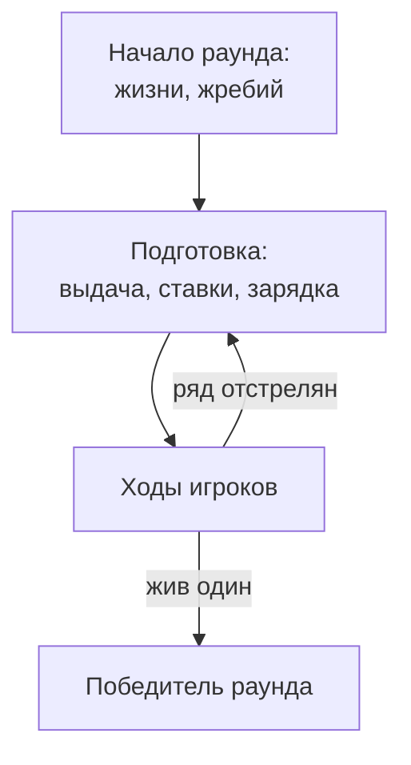

# Раунд и игра

Садятся несколько — встаёт один. Потом все садятся снова.

## Раунд

**Раунд**{ #t-раунд .term } начинается с чистого листа:

- все игроки живы, жизни раздаются поровну;
- фишек, предметов и эффектов ни у кого нет;
- круг очереди выбирается жребием.

Дальше идут расклады — один за другим, пока за столом не останется один
живой игрок. Он — победитель раунда. Раунд заканчивается сразу, даже
посреди расклада.

## Первый ход

Каждый должен начинать раунды одинаково часто. Поэтому раунд начинает
тот, кто начинал их реже всех; если таких несколько — случайный из них.
Круг очереди идёт от него.

## Игра

**Игра**{ #t-игра .term } — серия раундов с одним и тем же составом
игроков. Сколько раундов в игре, игроки договариваются до её начала.

Побеждает в игре тот, кто выиграл больше всех раундов. Если таких
несколько, они делят победу.

## Если игрок ушёл

Игрок может покинуть игру. Ушедший сразу считается погибшим и в
следующих раундах не участвует. Если за столом осталось меньше двух
игроков, игра заканчивается.

<figure class="illus">

<figcaption>Иллюстрация: пустой стол после раунда, один стул отодвинут, лампа всё ещё горит.</figcaption>
</figure>
