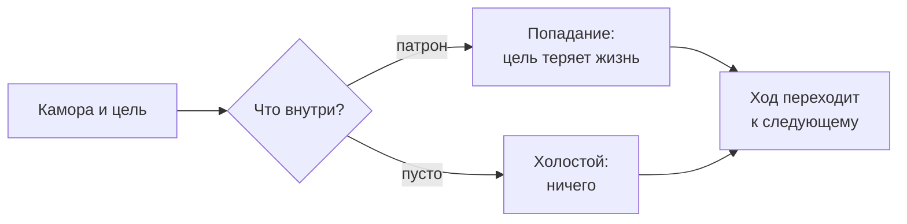

# Ход и выстрел

Выбери камору. Выбери, в кого. Нажми на спуск — и все узнают, что было внутри.

## Очередь

Игроки ходят по кругу. Порядок круга выбирается жребием и дальше не
меняется. Тот, чей сейчас **ход**{ #t-ход .term }, — **активный
игрок**{ #t-активный-игрок .term }.

## Выстрел

В свой ход активный игрок делает **выстрел**{ #t-выстрел .term }. Он
выбирает две вещи:

- **камору** — любую, из которой ещё не стреляли, в любом месте ряда;
- **цель**{ #t-цель .term } — любого живого игрока, в том числе себя.

Камора, из которой выстрелили, становится
**отстрелянной**{ #t-отстрелянная-камора .term }: её содержимое
открывается всем, и больше из неё не стреляют.

- Был патрон — это **попадание**{ #t-попадание .term }: цель теряет одну
  жизнь.
- Камора была пустой — это **холостой**{ #t-холостой .term } выстрел:
  ничего не происходит.

?
?
○
?
●
?
?
?

Из третьей каморы выстрелили холостым, из пятой — попали. Обе теперь отстреляны.

## Гибель

Игрок, у которого кончились жизни,
**погибает**{ #t-гибель .term }. Погибший больше не ходит, его пропускают
в очереди, и он не может быть целью.

## Передача хода

Выстрел передаёт ход следующему живому игроку по кругу — при любом
исходе: после попадания, после холостого, после выстрела в себя.

<figure class="illus">

<figcaption>Иллюстрация: рука над рядом камор, выбирающая, из какой стрелять.</figcaption>
</figure>
