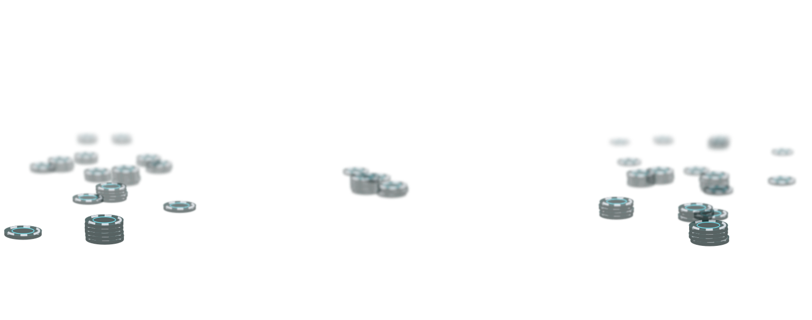
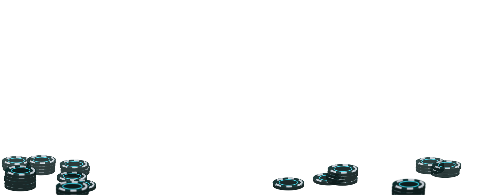
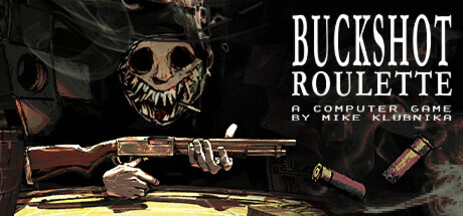
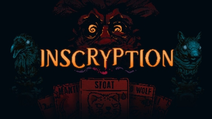
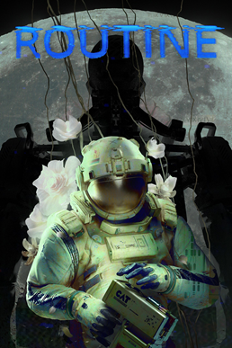

---
hide:
  - navigation
  - toc
  - footer
---

<svg class="crt__defs" aria-hidden="true">
<filter id="crt-barrel" x="0" y="0" width="1" height="1" primitiveUnits="objectBoundingBox" color-interpolation-filters="sRGB">
<feImage href="assets/crt/barrel-map.png" x="0" y="0" width="1" height="1" preserveAspectRatio="none" result="map"/>
<feDisplacementMap in="SourceGraphic" in2="map" scale="0.1" xChannelSelector="R" yChannelSelector="G"/>
</filter>
</svg>

В разработке

Игра по мотивам русской рулетки

Садятся несколько — встаёт один.

Выстрел в себя покупает будущее.

Каждый хочет обмануть.

Наблюдай. Считай. Рискуй.

Удачи.

## Ставки пока не принимаются

Зал ещё закрыт: движок в разработке, клиент — в планах. Но как здесь
играют, можно узнать уже сейчас, а когда откроются двери — следить в
блоге.

[:octicons-arrow-right-24: Как играть](rules/index.md){ .md-button .md-button--primary }
[:octicons-arrow-right-24: Открыть блог](blog/index.md){ .md-button }

## Проект

-   :material-book-open-variant:{ .chip-emblem } **Как играть**

    ---

    Полный свод правил: читается по порядку, от первой главы до
    последней.

    [:octicons-arrow-right-24: Читать](rules/index.md)

-   :material-engine-outline:{ .chip-emblem } **Движок**

    ---

    Сервер игры на Python: держит партию и честно применяет правила.
    Клиенты подключаются к нему по WebSocket.

    [:octicons-mark-github-16: LiveEngine](https://github.com/CaseyJohnson-RS/LiveEngine) ·
    [документация](https://caseyjohnson-rs.github.io/LiveEngine/)

-   :material-monitor-dashboard:{ .chip-emblem } **Клиент**

    ---

    Приложение, за которым сидит игрок: стол, ряд, предметы.

    *В планах*

-   :material-timeline-text-outline:{ .chip-emblem } **Блог**

    ---

    Как проект движется от идеи к столу, за которым можно сыграть:
    хронология и рассказы о вехах.

    [:octicons-arrow-right-24: Открыть блог](blog/index.md)

## Корни

<figure class="root">

<figcaption>
Buckshot Roulette
Рулетка за столом против соперника: выстрел в себя или в него, предметы, которые переворачивают расклад.
© Mike Klubnika, Critical Reflex
</figcaption>
</figure>

<figure class="root">

<figcaption>
Inscryption
Мрачный стол под одной лампой, за которым ставка — ты сам.
© Daniel Mullins Games, Devolver Digital
</figcaption>
</figure>

<figure class="root">

<figcaption>
Routine
Будущее, каким его видели в восьмидесятые: холодный свет ЭЛТ-мониторов и хром.
© Lunar Software, Raw Fury
</figcaption>
</figure>

