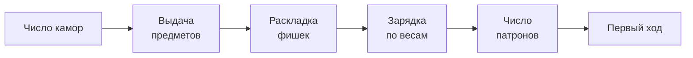

# Предметы

Правила за этим столом честные. Предметы — нет.

**Предметы**{ #t-предмет .term } гнут правила: подсказывают, что в ряду,
меняют его, лечат, путают соперников. Предметы, которые есть у игрока,
— его **рука**{ #t-рука .term }. Руку каждого игрока видят все.

<figure class="illus">

<figcaption>Иллюстрация: раскрытая ладонь с несколькими странными предметами под лампой.</figcaption>
</figure>

## Классы

Каждый предмет принадлежит одному **классу**{ #t-класс .term }:

- обычный — простые и частые;
- редкий — сильнее и реже;
- потолочный — самые сильные и
  самые редкие.

## Выдача

В начале раунда, ещё до раскладки фишек, идёт
**выдача**{ #t-выдача .term }:

1. Определяется набор выдачи — один на всех, например «обычный, обычный,
   редкий».
2. Каждый живой игрок получает по случайному предмету каждого класса из
   набора. Предметы разным игрокам выбираются независимо и могут
   совпасть.
3. Каждый выбирает, что оставить: любые предметы из прежней руки и
   новых, но не больше **лимита руки**{ #t-лимит-руки .term }. Всё, что не
   вошло, исчезает навсегда.

Что выпало каждому и что он оставил, другие узнают, только когда выбор
сделали все.

!!! note "Пока — случай"

    - **Лимит руки** — 8 предметов.
    - **Набор выдачи** — 2 или 3 предмета; класс каждого выбирается
      случайно: обычный — в 60% случаев, редкий — в 30%, потолочный — в
      10%.

## Подготовка

Всё, что происходит в начале раунда до первого хода, — это
**подготовка**{ #t-подготовка .term }. Теперь она целиком:

Во время подготовки предметы не применяются.

## Применение

В свой ход, пока идёт раунд, активный игрок может применять предметы —
сколько угодно, по одному, в любом порядке, до выстрела.

- Применённый предмет уходит из руки.
- Как сработал предмет, видят все, если в его описании не сказано иначе.
- Если предмету не на чем сработать — например, добавить патрон некуда
  или цель уже мертва, — он тратится впустую.
- Сам по себе предмет ход не передаёт. Некоторые предметы меняют это:
  позволяют передать ход без выстрела или выстрелить ещё раз.

## Эффекты

Некоторые предметы срабатывают не сразу, а оставляют на игроке
**эффект**{ #t-эффект .term } — например, «следующее попадание снимает
две жизни». Эффект действует, пока не сработает. Эффекты на каждом
игроке видят все.

## Между раундами

Рука, эффекты и пул фишек переходят в следующий раунд вместе с жизнями.

!!! tip "Совет"

    Руку соперника видно. Прежде чем стрелять в него, посмотри, чем он
    может ответить.

Что делает каждый предмет — в [каталоге предметов](items/index.md).
