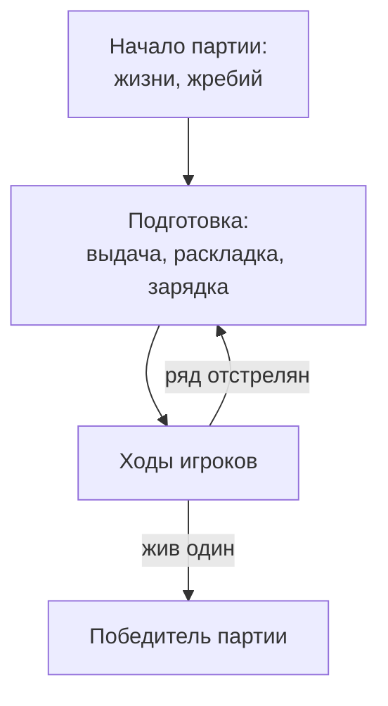

# Партия и игра

Садятся несколько — встаёт один. Потом все садятся снова.

## Партия

**Партия**{ #t-партия .term } начинается с чистого листа:

- все игроки живы, жизни раздаются поровну;
- фишек, предметов и эффектов ни у кого нет;
- круг очереди выбирается жребием.

Дальше идут раунды — один за другим, пока за столом не останется один
живой игрок. Он — победитель партии. Партия заканчивается сразу, даже
посреди раунда.

## Первый ход

Каждый должен начинать партии одинаково часто. Поэтому партию начинает
тот, кто начинал их реже всех; если таких несколько — случайный из них.
Круг очереди идёт от него.

## Игра

**Игра**{ #t-игра .term } — серия партий с одним и тем же составом
игроков. Сколько партий в игре, игроки договариваются до её начала.

Побеждает в игре тот, кто выиграл больше всех партий. Если таких
несколько, они делят победу.

## Если игрок ушёл

Игрок может покинуть игру. Ушедший сразу считается погибшим и в
следующих партиях не участвует. Если за столом осталось меньше двух
игроков, игра заканчивается.

<figure class="illus">

<figcaption>Иллюстрация: пустой стол после партии, один стул отодвинут, лампа всё ещё горит.</figcaption>
</figure>
