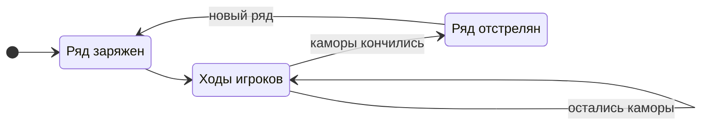

# Раунд

Каждый выстрел открывает одну камору. Каждая открытая камора — подсказка тому, кто считает.

**Раунд**{ #t-раунд .term } — время жизни одного каморного ряда: от того,
как ряд выложен, до того, как из каждой его каморы выстрелили.

## Начало раунда

1. Объявляется, сколько в ряду камор.
2. Ряд **заряжается**{ #t-зарядка .term }: патроны случайно раскладываются
   по каморам.
3. Объявляется, сколько в ряду патронов.

Дальше игроки ходят по очереди.

## Конец раунда

Раунд заканчивается, когда из каждой каморы выстрелили.

Раунд идёт, даже если патроны уже кончились: игроки стреляют, пока в
ряду остаются каморы.

## Новый ряд

Когда раунд закончился, на стол выкладывается новый ряд — с новым числом
камор и патронов, — и начинается следующий раунд.

Жизни между раундами сохраняются. Очередь тоже: следующий раунд
продолжает тот, чей сейчас ход.

## Считай

Число патронов объявлено в начале раунда, а содержимое каждой
отстрелянной каморы открыто. Значит, в любой момент можно сосчитать,
сколько патронов осталось в ряду.

?
?
?
?
?
?

«Два патрона из шести». Шанс нарваться на патрон — 2 из 6.

?
?
○
?
?
?

Из третьей — холостой. Патронов всё ещё два, камор осталось пять: 2 из 5.

?
?
○
?
●
?

Из пятой — попадание. Остался один патрон на четыре каморы: 1 из 4.

!!! tip "Совет"

    Шанс, что в каморе патрон, — это оставшиеся патроны, делённые на
    оставшиеся каморы. Чем дальше раунд, тем точнее этот расчёт — и тем
    дороже ошибка.

<figure class="illus">

<figcaption>Иллюстрация: наполовину отстрелянный ряд — пустые гильзы и нетронутые каморы.</figcaption>
</figure>
